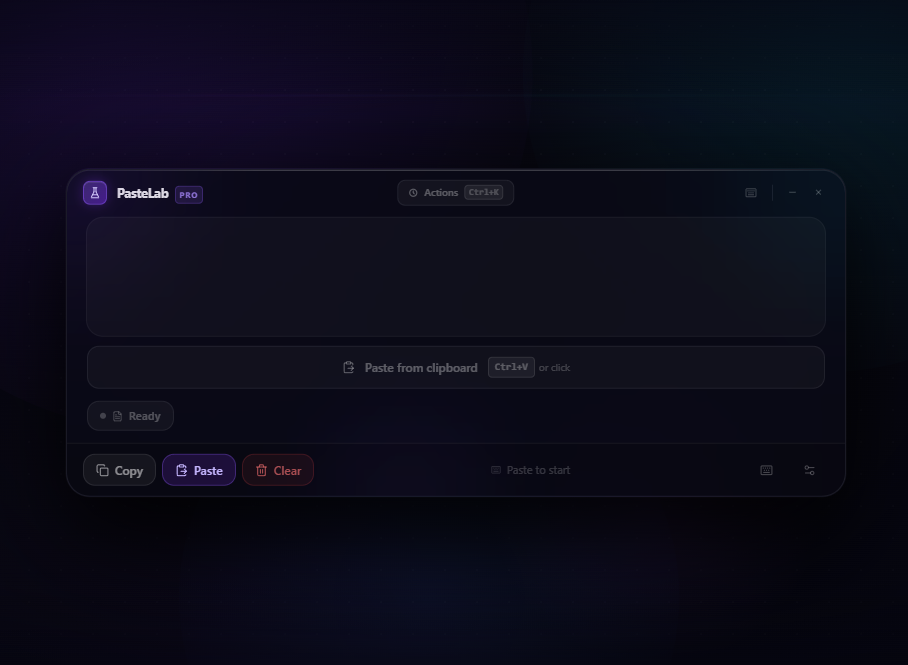
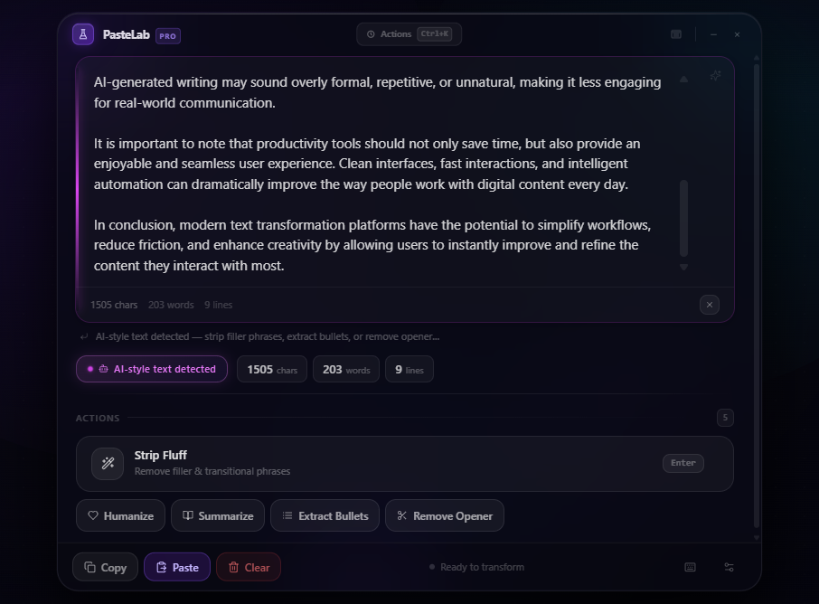
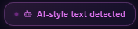
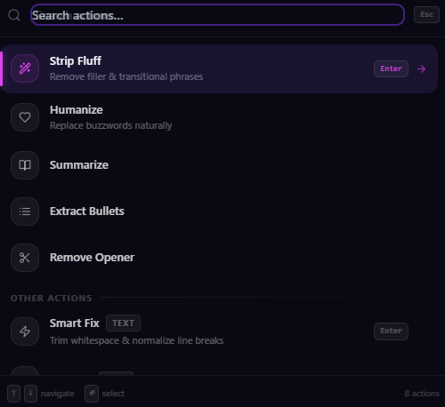
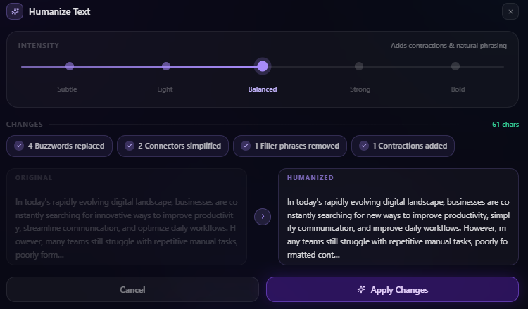
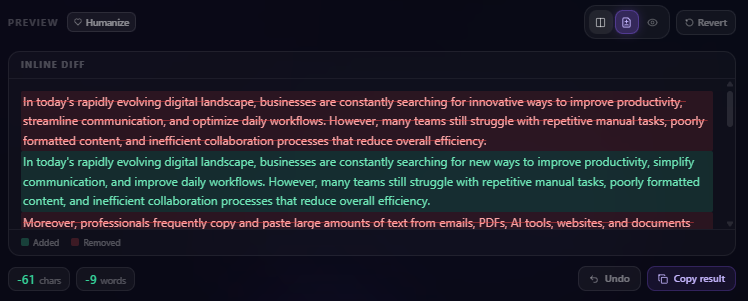
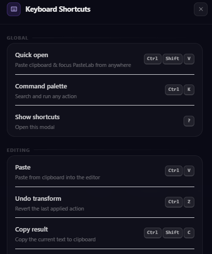
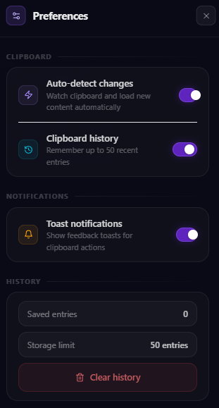

<div align="center">


# PasteLab

**Paste anything. Improve everything.**

A premium clipboard transformation tool for Windows.  
Detect, clean, and enhance any text in seconds without leaving your keyboard.

<br />

[](https://github.com/DrextenMax/Pastelab/releases/latest)
[](./LICENSE)
[](https://github.com/DrextenMax/Pastelab/releases)
[](https://tauri.app)
[](https://www.typescriptlang.org)

<br />

[**Download for Windows**](https://github.com/DrextenMax/Pastelab/releases/latest) · [Changelog](./CHANGELOG.md) · [Report a Bug](https://github.com/DrextenMax/Pastelab/issues/new?template=bug_report.yml) · [Request a Feature](https://github.com/DrextenMax/Pastelab/issues/new?template=feature_request.yml)

<br />



</div>

---

## What is PasteLab?

PasteLab is a lightweight desktop utility that lives in the background and springs to life the moment you paste. It automatically identifies what you copied — plain text, AI-generated prose, source code, a URL, JSON, a hex color, an email address, CSV data, Markdown, or a number — and surfaces exactly the right set of one-click transformations for it.

No setup. No cloud. No subscription. Everything runs locally.

---

## Features

### 🔍 Smart Content Detection

PasteLab instantly identifies what you've pasted and surfaces the right tools for it. Paste a block of AI-generated text and it flags it immediately:



<br />

The detection badge updates in real time as you type or paste:



Automatically classifies **12 content types**:

| Type | Auto-detected as |
|------|-----------------|
| Plain prose | `text` |
| AI-generated writing | `ai` |
| Source code | `code` |
| URLs | `url` |
| JSON / objects | `json` |
| Hex / RGB / HSL | `color` |
| Email addresses | `email` |
| Comma-separated data | `csv` |
| Markdown | `markdown` |
| Secrets / API keys | `secret` |
| Numeric values | `number` |

---

### ⚡ One-Click Transforms & Command Palette

Every action is accessible via the `Ctrl+K` command palette with fuzzy search:



Actions available per content type:

- **Text** — trim, fix spacing, title case, uppercase, lowercase, sentence case, reverse, sort lines
- **Code** — format JSON, minify JSON, escape/unescape, strip blank lines, clean spaces
- **URLs** — decode, encode, extract domain, strip tracking params
- **Colors** — convert between hex, RGB, HSL, CSS variables
- **AI text** — strip filler, humanize, summarize, extract bullets, remove opener
- **Markdown** — strip formatting, convert to plain text
- **Numbers** — format with commas, percentage, scientific notation

---

### 🤖 AI Text Humanizer

Five-level humanizer that strips AI openers, filler phrases, and buzzwords — then adds natural contractions and real sentence rhythm.



<br />

A live word-level diff shows exactly what changed before you commit:



---

### ⌨️ Keyboard-First

Every action is one shortcut away. The mouse is optional.



**Global**

| Shortcut | Action |
|----------|--------|
| `Ctrl+Shift+V` | Quick-open PasteLab from anywhere (works system-wide) |
| `Ctrl+K` | Open / close command palette |
| `?` | Show keyboard shortcuts modal |

**Editing**

| Shortcut | Action |
|----------|--------|
| `Ctrl+V` | Paste from clipboard into the editor |
| `Ctrl+Z` | Undo last transform |
| `Ctrl+Shift+C` | Copy result to clipboard |
| `Ctrl+K` | Clear panel and reset (when inside the editor) |
| `Esc` | Clear text or close any open panel |

**Navigation**

| Shortcut | Action |
|----------|--------|
| `Ctrl+,` | Open preferences panel |
| `↑` / `↓` | Navigate items in the command palette |
| `Enter` | Execute the selected palette action |

**Humanize panel**

| Shortcut | Action |
|----------|--------|
| `1` | Intensity: Subtle |
| `2` | Intensity: Light |
| `3` | Intensity: Balanced |
| `4` | Intensity: Strong |
| `5` | Intensity: Bold |
| `Enter` | Apply humanized changes |

---

### ⚙️ Preferences

Control clipboard watching, history, and notifications:



### 📋 Clipboard History
The last 50 clipboard entries are saved locally and instantly accessible. Secrets and API keys are **never stored**.

### 🔒 100% Local
No accounts. No telemetry. No network requests. All transforms run in-process — your clipboard never leaves your machine.

---

## Installation

### Option A — Installer (recommended)

1. Go to [**Releases**](https://github.com/DrextenMax/Pastelab/releases/latest)
2. Download `PasteLab_1.0.0_x64-setup.exe`
3. Run the installer — no admin rights required (installs per-user)
4. Launch from the Start Menu or Desktop shortcut

### Option B — Build from source

**Prerequisites**
- [Node.js 18+](https://nodejs.org)
- [Rust stable](https://rustup.rs)
- [Tauri v2 prerequisites for Windows](https://tauri.app/start/prerequisites/)

```bash
# Clone the repo
git clone https://github.com/DrextenMax/Pastelab.git
cd pastelab

# Install JS dependencies
npm install

# Start in development mode (hot-reload)
npm run tauri dev

# Build the production installer
npm run tauri build
# → installer written to src-tauri/target/release/bundle/nsis/
```

---

## Tech Stack

| Layer | Technology |
|-------|-----------|
| Desktop shell | [Tauri v2](https://tauri.app) (Rust) |
| Frontend | [React 18](https://react.dev) + [TypeScript 5](https://typescriptlang.org) |
| Animations | [Framer Motion 11](https://www.framer.com/motion/) |
| Styling | [Tailwind CSS 3](https://tailwindcss.com) |
| Icons | [Lucide React](https://lucide.dev) |
| Bundler | [Vite 5](https://vitejs.dev) |
| Clipboard | `tauri-plugin-clipboard-manager` |
| Global shortcuts | `tauri-plugin-global-shortcut` |

---

## Project Structure

```
pastelab/
├── src/
│   ├── components/
│   │   ├── app/          # Feature components (ClipPanel, CommandPalette, …)
│   │   ├── layout/       # TitleBar, Sidebar, AppLayout
│   │   └── ui/           # Primitive components (Button, Card, Toast, …)
│   ├── context/          # React context (ToastContext)
│   ├── hooks/            # useSettings, useClipboardHistory, useClipboardWatcher
│   ├── pages/            # Dashboard, History, Pinned, Settings
│   ├── utils/            # transforms, diff, humanize, format, clipboard
│   └── types/            # Shared TypeScript types
├── src-tauri/
│   ├── src/              # Rust entry points (lib.rs, main.rs)
│   ├── icons/            # App icons (all sizes, generated from icon.svg)
│   ├── capabilities/     # Tauri permission manifest
│   └── tauri.conf.json   # App configuration
├── screenshots/          # Product screenshots
└── .github/
    ├── workflows/        # CI/CD — automated Windows release builds
    └── ISSUE_TEMPLATE/   # Bug & feature request forms
```

---

## Roadmap

| Status | Item |
|--------|------|
| ✅ | Windows release with NSIS installer |
| ✅ | 12-type content detection |
| ✅ | Command palette (`Ctrl+K`) |
| ✅ | Clipboard history (50 entries) |
| ✅ | AI text humanizer (5 levels) |
| ✅ | Word-level diff preview |
| ✅ | Keyboard shortcuts modal |
| ✅ | Slide-in preferences panel |
| 🔜 | macOS support |
| 🔜 | Regex find & replace |
| 🔜 | Custom transform pipelines |
| 🔜 | Multi-item clipboard history UI |
| 🔜 | End-to-end encrypted cloud sync |
| 🔜 | Plugin / extension API |
| 🔜 | Auto-update |

---

## Contributing

Contributions are welcome! Please read [CONTRIBUTING.md](./CONTRIBUTING.md) before opening a PR.

```bash
# After cloning, start the dev server:
npm run tauri dev

# Before opening a PR, verify everything passes:
npm run type-check   # zero TypeScript errors
npm run lint         # zero ESLint warnings
npm run build        # clean production bundle
```

See [open issues](https://github.com/DrextenMax/Pastelab/issues) for good first contributions — anything tagged `good first issue` is a great place to start.

---

## Releasing a New Version

1. Bump the version in **both** `package.json` and `src-tauri/tauri.conf.json`
2. Update `CHANGELOG.md`
3. Commit: `git commit -m "chore: release v1.x.x"`
4. Tag: `git tag v1.x.x && git push origin main --tags`
5. GitHub Actions builds the Windows installer automatically and creates a draft release
6. Review the draft, add release notes, and publish

---

## License

[MIT](./LICENSE) © 2026 PasteLab Contributors

---

<div align="center">
  Built with ❤️ in La Mancha &nbsp;·&nbsp; by <strong>Drextenmax</strong>
</div>
